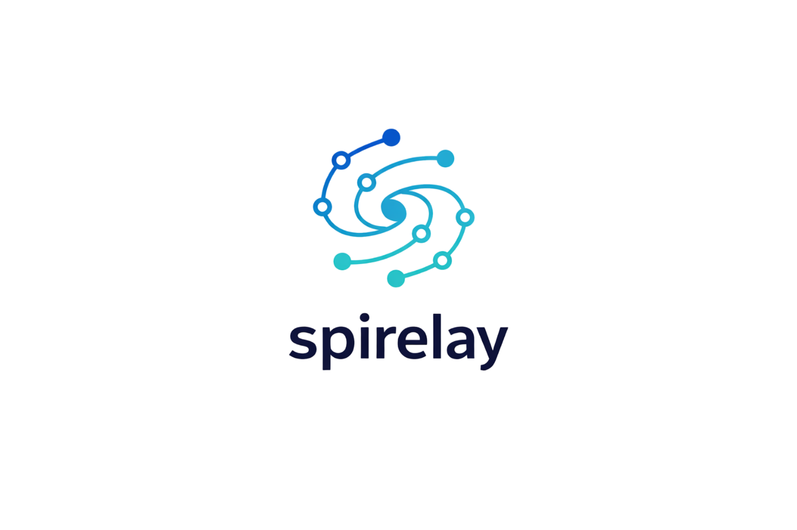

<div align="center">
  
    
  # ⚡ SPIRELAY (Project Delta)
  **High-Performance Algorithmic Spaced Repetition Engine for Engineering Students**

  [](https://spirelay.vercel.app)
  [](https://spirelay.onrender.com)
  [](https://supabase.com)
  
</div>

## 📖 Overview

Spirelay is a multi-tenant, full-stack educational platform engineered to automate the retention of complex **Electrical and Computer Engineering (ECE)** curriculum. By synthesizing modern vertical-feed engagement with a highly customized **SuperMemo-2 (SM-2) Spaced Repetition Algorithm**, Spirelay provides a personalized, mathematically optimized learning path to combat the "forgetting curve."

[Live Production Environment 🚀](https://spirelay.vercel.app)

---

## 🧠 Core Features

* **Algorithmic "Smart Feed":** Dynamically interleaves subjects and prioritizes review content based on exponential memory decay calculations ($R = e^{-t/S}$).
* **Hardened Cloud Security:** Implements **Row Level Security (RLS)** and Role-Based Access Control (RBAC) to ensure total data isolation between student tenants.
* **Neural Mastery Tracking:** Real-time analytics engine that calculates mastery scores based on active recall performance.
* **Admin Content Studio:** A protected super-user environment for curriculum CRUD operations and platform-wide diagnostic tools.

---

## 🏗️ System Architecture

The platform utilizes a strictly decoupled **Three-Tier Architecture** optimized for high availability and low latency.

| Layer | Technology | Role |
| :--- | :--- | :--- |
| **Presentation** | **Next.js 16 (Turbopack)** | Server-side rendering & mobile-first UI |
| **Application** | **FastAPI (Python 3.12)** | Asynchronous API & SM-2 Logic Engine |
| **Data** | **PostgreSQL (Supabase)** | Relational storage with RLS security policies |
| **Auth** | **Supabase Auth / JWT** | Secure session management & Email verification |

---

## 🔐 Production Security & DevOps

Spirelay is built with a **"Secure-by-Default"** philosophy:

* **Auto-Hardening DB:** Utilizing Postgres Event Triggers to automatically enable RLS on all new schema objects.
* **CORS Perimeter:** Strict Cross-Origin Resource Sharing (CORS) policies using regex-validated Vercel origins.
* **CI/CD Pipeline:** GitHub Actions automatically execute `pytest` suites and production build verifications on every Pull Request.
* **Environment Isolation:** Complete separation of `Development`, `Preview`, and `Production` variables across the Vercel/Render handshake.

---

## 🚀 Getting Started (Local Development)

### 1. Prerequisites
* **Node.js** (v18+) & **Python** (v3.12+)
* **Supabase** Project (Auth & PostgreSQL)

### 2. Environment Configuration
Create a `.env` file in the `backend` and a `.env.local` in the `frontend`.

**`backend/.env`**
```
SUPABASE_URL="your_project_url"
SUPABASE_KEY="your_service_role_key"
FRONTEND_URL="http://localhost:3000"
frontend/.env.local

NEXT_PUBLIC_API_URL="http://localhost:8000"
NEXT_PUBLIC_SUPABASE_URL="your_project_url"
NEXT_PUBLIC_SUPABASE_ANON_KEY="your_anon_key"
```

### 3. Launching the System
Terminal 1 (Backend):
```
cd backend && source venv/bin/activate
pip install -r requirements.txt
uvicorn main:app --reload
```
Terminal 2 (Frontend):
```
cd frontend && npm install
npm run dev
```
🎓 Academic Context

Lead Architect: Aiman Abed

Institution: Tel Aviv University

Focus: Electrical Engineering

Project Delta is an ongoing initiative to bridge the gap between social-media engagement and academic rigor.
